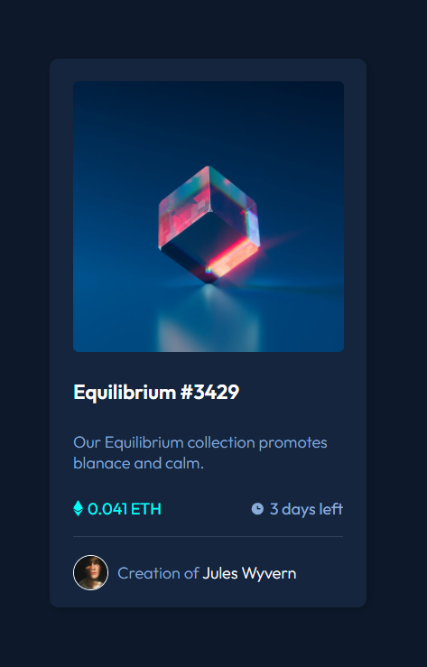

# Frontend Mentor - NFT preview card component solution

This is a solution to the [NFT preview card component challenge on Frontend Mentor](https://www.frontendmentor.io/challenges/nft-preview-card-component-SbdUL_w0U). Frontend Mentor challenges help you improve your coding skills by building realistic projects.

## Table of contents

- [Overview](#overview)
- [The challenge](#the-challenge)
- [Screenshot](#screenshot)
- [My process](#my-process)
- [Built with](#built-with)
- [What I learned](#what-i-learned)
- [Continued development](#continued-development)
- [Author](#author)
- [Acknowledgments](#acknowledgments)

## Overview

### The challenge

Users should be able to:

- View the optimal layout depending on their device's screen size
- See hover states for interactive elements

### Screenshot

## My process

Started with a basic HTML boilerplate with the use of VS Code and started working from the ground up. First tackling centering the main content in the middle of the screen and building up the sections from there. Chose a size of the main container that holds all of the content via experimentation and gave each item it's own container for easier control. Input the raw HTML and style the elements accordingly, this was done one section at a time until the desired result was achieved. As with any good developer, Google was consulted for some of the items and i "rinsed and repeated" from scratch until I understood the process and the best ways to move forward with this challenge/project.

### Built with

- Microsoft Edge
- VS Code
- BEM class naming convention
- CSS custom properties
- Flexbox
- Sass/Scss

### What I learned

- The use of transitions and display property choices.
- Using multiple containers to make easier control of the desired look.
- Responsive design workflow.
- Hovering over an image and changing its appearance.
- The BEM naming convention

### Continued development

- This have been redeveloped as I have been learning. I feel as though this small project has reached it's peak.

## Author

- Website - Christopher Carruthers (https://github.com/Chris971991)
- Frontend Mentor - @Chris971991 (https://www.frontendmentor.io/profile/Chris971991)

## Acknowledgments

I would like to put a word out for all the devs at Front End Mentor and thank them for creating a platform for people who want a challenge whilst learning Web Developement.
